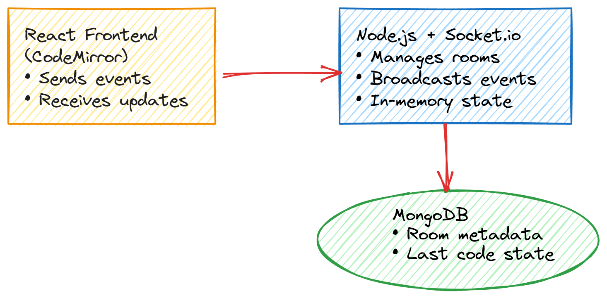
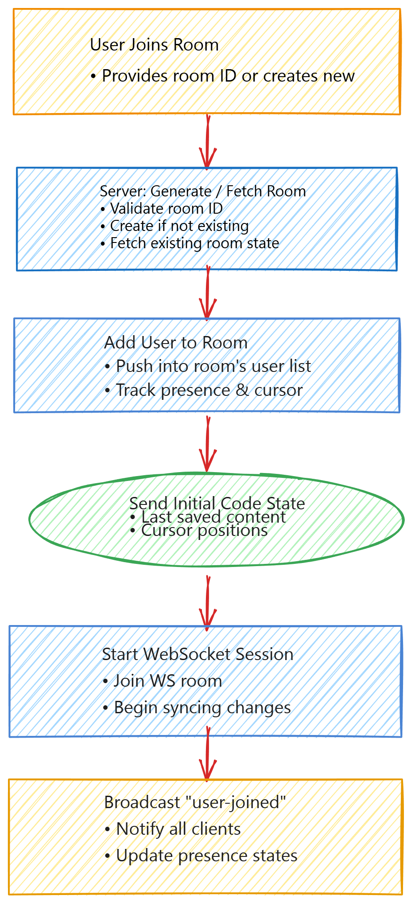

# 🚀 Real-Time Code Collaborator

A full-stack, real-time collaborative code editor that allows multiple users to join a shared room, write and edit code simultaneously, and execute code in multiple programming languages. This project demonstrates real-time systems, WebSockets, and clean full-stack architecture.

---

## 🌟 Key Highlights

- Real-time multi-user collaboration using WebSockets
- Room-based architecture with live participant tracking
- Instant code synchronization across clients
- Multi-language code execution using external API
- Clean separation of frontend & backend
- Secure environment variable management
- Industry-standard Git and project structure

---

## ✨ Features

- 👥 Multiple users can join the same room using a unique Room ID
- 🔄 Live code updates across all connected users
- ✍️ Syntax-highlighted code editor (CodeMirror)
- ▶️ Run code in multiple languages (via JDoodle API)
- ⚡ Low-latency real-time communication using Socket.IO
- 🚪 Automatic user join & leave handling
- 🔐 Environment variables protected using `.env`

---

## 🛠️ Tech Stack

### Frontend
- React.js
- CodeMirror
- Socket.IO Client
- HTML5, CSS3, JavaScript (ES6+)

### Backend
- Node.js
- Express.js
- Socket.IO
- JDoodle API (for code execution)

### Tools & Practices
- Git & GitHub
- Environment Variables
- Modular Architecture
- Clean Commit History

---
## 📂 Project Structure
```txt
📂 Real-Time-Code-Collaborator
│
├── client
│   ├── src
│   │   ├── components
│   │   │   ├── Home.js
│   │   │   ├── Editor.js
│   │   │   ├── EditorPage.js
│   │   │   └── Client.js
│   │   ├── Actions.js
│   │   ├── Socket.js
│   │   └── App.js
│   ├── public
│   ├── package.json
│   └── .gitignore
│
├── server
│   ├── index.js
│   ├── Actions.js
│   └── package.json
│
├── .gitignore
└── README.md

```


## ▶️ How to Run the Project Locally

### 1️⃣ Clone the Repository
```bash
git clone https://github.com/Komalsingh-26/Real-Time-Code-Collaborator.git
cd Real-Time-Code-Collaborator
```

### 2️⃣ Start Backend Server
```bash
cd server
npm install
node index.js
```

Backend runs at:
```
http://localhost:5000
```

### 3️⃣ Start Frontend (New Terminal)
```bash
cd client
npm install
npm start
```

Frontend runs at:
```
http://localhost:3000
```

---
## ⚙️ Architecture Overview

Real-Time Code Collaborator is built on an event-driven, WebSocket-based architecture designed for real-time, multi-user code editing with low latency.

---

## ⚙️ Architecture Overview

Real-Time Code Collaborator is built on an event-driven, WebSocket-based architecture designed for real-time, multi-user code editing with low latency.

---

### 🏗️ System Architecture
Shows how the frontend, backend, and database interact.



---

### 🔌 WebSocket Communication Flow
Explains how real-time events propagate between clients through the Socket.IO server.


---

### 👥 Room Management Flow
Illustrates how users join rooms, load initial code state, and start synchronized editing sessions.




---

## 👩‍💻 Author

**Komal Singh**  
🎓 B.Tech – Computer Science  
💼 Aspiring Full-Stack / SDE-1 Engineer  

🔗 GitHub: https://github.com/Komalsingh-26
---

## ⭐ Recruiter Note

This project demonstrates practical experience with **real-time systems, WebSockets, full-stack development, and clean Git practices**, making it suitable for **SDE-1, Frontend, and Full-Stack roles**.

If you find this project useful, feel free to ⭐ star the repository!
